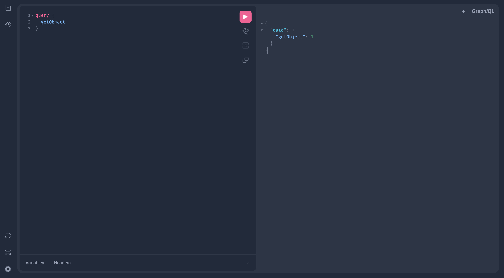

# Task-Tromzo

## The code assignment.

STEP 1:
Design an ObjectMgr which manages a pool of objects. Objects can be considered to be ints (from 1 to n). It should provide api’s to get_object() and free_object():

get_object(): Returns any object available in the pool. An object cannot be given away again unless it has been freed.
free_object(int obj): Returns the object back to the pool so that it can be given out again.

Please document the API’s definitions, data structures and write tests.

STEP 2:

1. Write a GraphQL API schema to use the above functions to create, get and free objects.
2. Deploy it as a service/container that can be used to deploy on a linux server.

# Answer

In **.app/object/objectmgr.py**, created class ObjectMgr.

```python
from collections import deque
from typing import Union

class ObjectMgr:
    def __init__(self, n: int):
        self.object_pool = deque(range(1, n))
        self.allocated_objects = set()
        self.freed_objects = deque()
```

## Decided to use:

- deque() - efficient element addition and removal.

```python
    def get_object(self) -> Union[int, None]:
        if self.object_pool:
            obj = self.object_pool.popleft()
            self.allocated_objects.add(obj)
            return obj
        elif self.freed_objects:
            obj = self.freed_objects.popleft()
            self.allocated_objects.add(obj)
            return obj
        else:
            return None
```

- set() - efficient to check whether an object is currently allocated or not.

```python

    def free_object(self, obj) -> Union[int, None]:
        if obj in self.allocated_objects:
            self.allocated_objects.remove(obj)
            self.freed_objects.append(obj)
            return obj
        else:
            raise ValueError("Object is not currently allocated.")
```

# Installation

- ## Development

0. Make sure your python is <= "3.10.\*"

1. Create virtual env, with:

```shell
python -m venv .venv
```

2. move to _app_ folder'

```shell
cd ./app
```

3. Install requirements with pip:

```shell
pip install -r requirements.txt
```

4. Or install requirements with poetry:

```shell
poetry install
```

3. To run app:

```shell
flask run
```

```shell
flask --debug run
```

```shell
python app.py
```

```shell
gunicorn --worker-class gevent --workers 8 --bind 127.0.0.1:5000 app:"create_app()" --max-requests 10000 --timeout 5 --keep-alive 5 --log-level info --log-level info
```

- ## To run with docker-compose

1. create **docker-compose.yml** from:

   - **docker-compose.dev.yml**
   - or
   - **docker-compose.prod.yml**

2. ### run

   ```shell
   docker-compose up
   ```

# Production

## To run application as linux service

- create /etc/systemd/system/tromzo-service.service

```shell
[Unit]
Description=Gunicorn instance to serve
After=network.target

[Service]
User=mngr-user
Group=www-data
WorkingDirectory=/home/tromzo/app
Environment="PATH=/home/tromzo/app/.venv/bin"
ExecStart=/home/tromzo/app/.venv/bin gunicorn --worker-class gevent --workers 8 --bind 0.0.0.0:3000 app:"create_app()" --max-requests 10000 --timeout 5 --keep-alive 5 --log-level info

[Install]
WantedBy=multi-user.target
```

```shell
sudo systemctl start tromzo-service
sudo systemctl enable tromzo-service
```

## To run application as container

```shell
docker run --publish 3000:3000 -it --entrypoint ./start.sh objmngr-server/graphql
```

# config

- in _config.py_ if

```python
default = "DevelopmentConfig"
```

- visit _{your_host}/graphql_ to see/test API definitions



# Query examples:

#### get_object() query:

#### _Returns any object available in the pool_

```graph
query {
  getObject
}
```

#### free_object() mutation:

#### _Returns the object back to the pool so that it can be given out again_

```graph
mutation {
    freeObject(obj: 1) {
        success
    }
}
```

#### _postman_collection.json_ is available

# Tests

- To run tests

```shell
pytest
```
